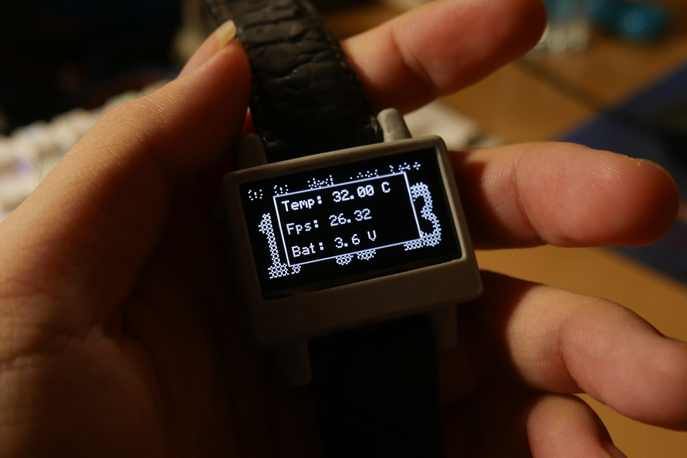

# Monochrome-Oled-GUI
Graphic display library for monochrome display with built-in animated engine

<figure>
  
  <figcaption align=center>Oled GUI on my own stm32 wrist-watch</figcaption>
</figure>


## Brief description about GUI
<figure>
  
</figure>

Every widget has its base widget call gui_obj, which is located in "gui_core.h". And basically they have x, y, w, h, the bitmap_array to be drawn. 

## Working principle
The GUI has 2 link-lists. One to hold list of widgets. One to hold list of animations. Gui has 2 methods to take list of widgets and draw it, and to take list of animations to update attributes of widgets.

<figure>
  
    <figcaption>Method to draw</figcaption>
</figure>

<figure>
  
    <figcaption>Method to animate</figcaption>
</figure>


## Porting
Firstly in "gui_cfg.h", my display is sh1106 128x64. and im using stm32f103. Use GUI_LOG to keep track of errors.
So config looks like this.

```c
#define GUI_CFG_DISPLAY_W   128
#define GUI_CFG_DISPLAY_H   64

#define GUI_CFG_TICK_MAX        0xFFFFFFFF /* 32-bit CPU */

#define GUI_CFG_USE_LOG 0
```

In "gui_port.h". These APIs according to your hardware are needed. Buffer size will be equal to GUI_CFG_DISPLAY_W * GUI_CFG_DISPLAY_H / 8.
```c
#if GUI_CFG_USE_LOG == 1
#define GUI_LOG(msg)      gui_log((uint8_t *)__FILE__, __LINE__, (uint8_t *)msg)
    extern void gui_log(uint8_t *file, uint32_t line, const uint8_t *msg);  
#else  
#define GUI_LOG(msg) (void)0
#endif

extern uint32_t get_tick(void);

extern void oled_init(void);

extern void oled_on(void);

extern void oled_off(void); 

extern void oled_invert(uint8_t i);

extern void oled_set_brightness(uint8_t value);

extern void oled_update(const uint8_t * buffer); 
```
Most important methods are ```get_tick()```, ```oled_init()``` and ```oled_update(buff)```.

## Using 
GUI need one thread to run, and current system tick to draw properly. Additionally, you need to supply a method to draw buffer to display.

Include only one header file ```gui.h``` to use GUI.

We walked through ```get_tick()```. To init the GUI, call ```gui_initialize()``` before the loop function, and call ```gui_run()``` to run repeatedly in loop.

## Creating an object
Every widget has API to create and destroy. Calling destroy is very important. If not then it will lead to undefined behavior. 
Destroy method is same for all widgets:

```c
my_widget.destroy();
```
```NOTE:``` Call destroy only if create method called before.

### Dynamically creating
```c
gui_label *my_label = new gui_label();
my_label->create(0, 0);
my_label->printf("Hello World!");
my_label->destroy();
```
### Statically creating
```c
gui_label my_label;
my_label.create(0, 0);
my_label.printf("Hello World!");
my_label.destroy();
```
Once you destroy widget, it is no more drawn on screen.

## References
Many thanks to these resources, which help me a lot:

+ https://github.com/ZeekiChen/iWatch-v2.0

+ https://github.com/lvgl/lvgl 

+ https://github.com/Sheep118/WouoUI-PageVersion

+ https://github.com/epcbtech/ak-base-kit-stm32l151